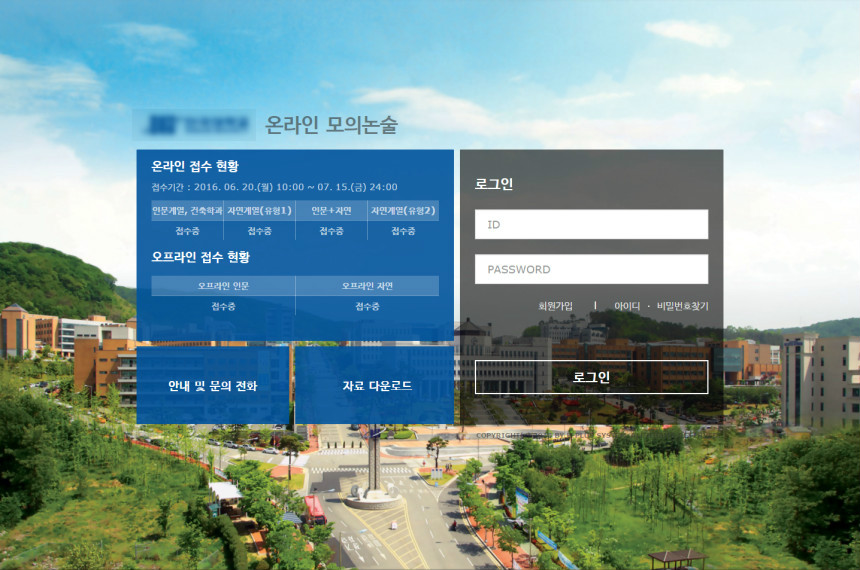
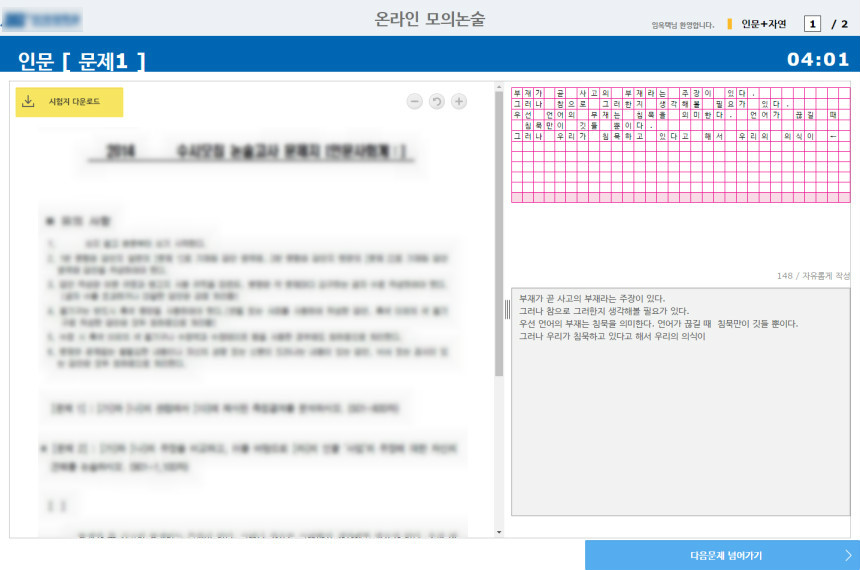
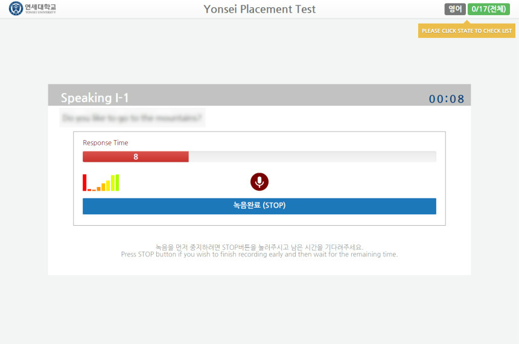
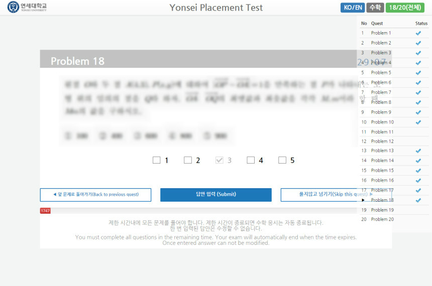

# 경력소개서

* 성명: 임옥택 (1990.06.15)
* E-Mail: [downmix@downmix.net](mailto:downmix@downmix.net)

___

## 학력

* 2007 - 2009 부천정보산업고등학교
* 2009 - 2010 인천전문대학 컴퓨터정보학과
* 2012 - 2015 인천대학교 컴퓨터공학과

___

## 수상내역

* 경기도기능경기대회 정보기술 우수상 (국제기능올림픽위원회, 2008)
* 상업정보능력경진대회 전자문서 장려 (경기도교육청, 2008)
* 전국 정보과학 경시대회 컴퓨터활용 고등부 장려 (한국정보과학진흥협회, 2008)

___

## 보유기술

*   주요기술
    - Java, Spring, Tomcat, Oracle, JavaScript, bootstrap, Subversion

*   학습중인 또는 레거시
    - JavaScript(ES6), Node.js, npm, React.js, babel, webpack, [Github](https://github.com/downmix)
    - Apache, PHP, MariaDB, Ubuntu

___

## 유플러스시스템

*    재직기간: 2015.05 ~ 2017.07
*    직위: 사원 > 주임

### 온라인 모의논술고사 시스템

*   **시스템 소개:**

   기존의 오프라인 논술고사를 온라인으로 모의고사를 실시하는 시스템.
   접수, 논술 응시, 채점, 결과조회 까지 운영되는 사내솔루션

*   **개발 기간:** 2016.02 ~ 2016.05

*   **업무:** 모의논술고사 사용자 단 설계 및 개발
    - 전체 시스템 설계, 프레임워크 작성
    - 사용자 가입 및 인증처리
    - 시스템설정 기반의 접수, 응시
    - Single Page 응시 구성
    - 크로스브라우저 퍼블리싱(IE, Chrome)
    - 개발 및 운영환경 구성

*   **기타**
    - 2016년도 경희대, 단국대, 건국대, 세종대, 인하대 등 7개 대학수행
    - 기존 웹퍼블리싱 성격의 웹사이트를 솔루션형태로 개발
    - 고객별(대학) 커스텀마이징 지원

* **사용기술**: Java, Spring, Oracle, Mybatis, jQuery, bootstrap

* ScreenShot

### 연세대학교 신입생 진단평가 시스템

*   **시스템 소개:**

   신입생 수강신청에 앞서, 학력수준을 평가하여 수준별 커리큘럼을 위한 온라인 진단평가 시스템.
   음성녹음, 객관식 주관식 응시, 채점, 전형이관 운영되는 납품솔루션

*   **개발 기간:** 2016.01 ~ 2017.01

*   **업무:** 진단평가 사용자 단 설계 및 개발
    - 프로토타입판 개발 및 운영
    - 납품시스템 고도화 작업
    - 시스템설정 기반의 접수, 응시
    - Single Page 응시 구성
    - 개발 및 운영환경 구성

*   **기타**
    - HTML5의 Audio API를 활용한 웹 음성녹음 지원
    - 제한된 응시환경을 위한 Chrome Kiosk활용

* **사용기술**: Java, Spring, Oracle, Mybatis, HTML5, jQuery, bootstrap
* ScreenShot

### 온라인논술채점 유지보수 및 운영

사내 메인솔루션 운영, 유지보수.
- 추가기능, 이슈사항 개발
- 고객별(대학) 현장 커스텀마이징 지원
- 기초데이터 가공. 결과 및 통계 데이터 산출

* 사용 기술: Java, Spring, Oracle, Mybatis, KendoUI

### 사내 시스템 운영

*   업무:
    - 상기 외 사내 시스템 현장운영
      - 입시서류스캔 시스템
      - 실기채점 시스템
    - 각종 서버 및 네트워크 장애 해결
    - 사업별 발생되는 이슈사항 상시 유지보수

___

## 자격증

* 컴퓨터활용능력 1급 (대한상공회의소, 2008.07)
* PC Master(정비사) (한국정보평가협회, 2009.06)
* MOS Master (Microsoft, 2010.01)
